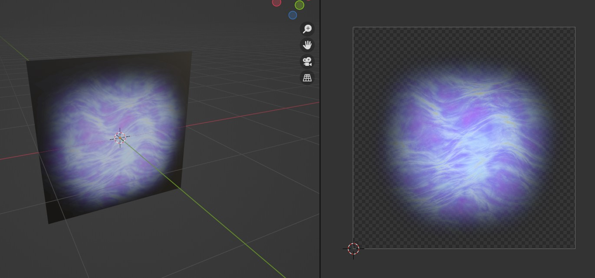
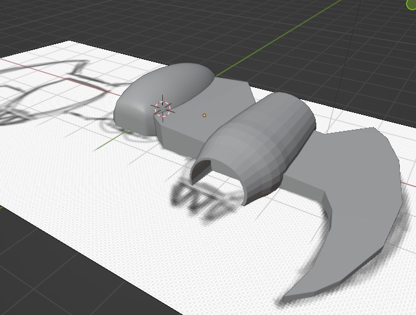
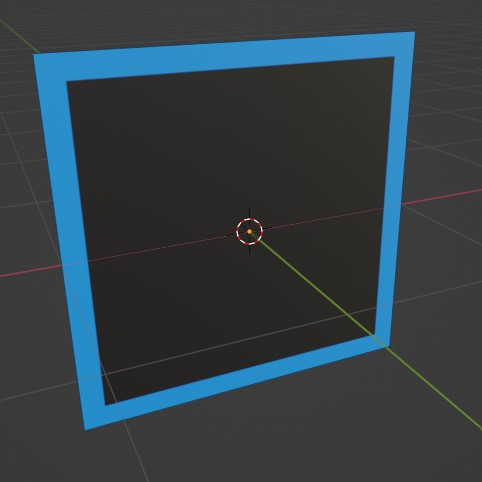

# AirplaneGame

A flight/dogfight game over a procedurally generated planet, written from
scratch in C++20 on modern OpenGL. The terrain is raised on the GPU by a
tessellation pipeline whose displacement function is injected into the shader
source at load time, so the same noise definition drives both the rendered
surface and the CPU-side collision queries.



## What is in here

| Area | Notes |
| ---- | ----- |
| Rendering | Modern OpenGL 4.4 core, tessellation control/evaluation stage for the planet surface, custom particle system for engine plasma and explosions |
| World | Layered domain-warped value noise, generated once into a texture and shared by the shaders and the CPU |
| Physics | Rigid bodies with quaternion orientation, capped torque control, collision detection against the terrain and between vehicles |
| Timing | The simulation runs on a fixed 120 Hz tick. Tuning is written in SI units and converted to tick units at the point of definition (`src/PhysicsUnits.h`), so the configured behaviour stays fixed in real-world terms if the tick rate is retuned |
| Audio | OpenAL, with WAV decoding through AudioFile |
| Precision | Double precision throughout (`dvec3`, `dquat`) so the camera stays stable far from the origin |

## Prerequisites

- CMake 3.16+
- A C++20 compiler (GCC/Clang on Linux, MSVC or MSYS2/UCRT64 on Windows)
- assimp, glfw3, OpenGL and OpenAL development packages

On Debian/Ubuntu:

```sh
sudo apt install build-essential cmake libglfw3-dev libassimp-dev libopenal-dev
```

glad, glm, stb_image, AudioFile and the OpenAL headers are vendored under
`external/`, so nothing else needs to be fetched.

## Build and run

```sh
cmake --preset dev-release
cmake --build --preset dev-release
cd bin && ./AirplaneGame
```

`CMakeUserPresets.json` is gitignored — it is personal to your machine. A
minimal one:

```json
{
  "version": 3,
  "configurePresets": [
    { "name": "dev-release", "binaryDir": "${sourceDir}/build/dev-release",
      "cacheVariables": { "CMAKE_BUILD_TYPE": "Release" } }
  ],
  "buildPresets": [ { "name": "dev-release", "configurePreset": "dev-release" } ]
}
```

The game must run with `bin/` as its working directory: it opens shaders by
bare filename and reaches the assets as `../media/...`. The build stages the
shaders and the noise tables into `bin/` for exactly that reason.

## Controls

Flight mode (the default), arcade control scheme:

| Input | Action |
| ----- | ------ |
| Mouse | Pitch and yaw |
| W / S | Pitch up / down |
| A / D | Roll left / right |
| ← / → | Yaw |
| Left Shift | Afterburner (double thrust) |
| Left Ctrl | Air brake (reverse thrust, tighter pitch) |
| Left mouse / Space | Fire |
| F / G | Zoom in / out |
| M | Toggle mouse lock |
| O | Toggle between flight and free camera |
| N | Cycle simulation speed |
| T | Toggle wireframe |
| L | Reload shaders |
| R | Restart |
| Esc | Quit |

Free camera mode (`O`):

| Input | Action |
| ----- | ------ |
| WASD | Move |
| Space / Left Shift | Up / down |
| Arrow keys, Q / E | Look |
| C / V | Increase / decrease movement speed |

## Layout

```
src/        game sources, shaders, and the prebaked noise tables
external/   vendored third-party headers (glad, glm, stb, AudioFile, AL)
media/      models, textures and sound effects the game loads
bin/        build output and runtime working directory (gitignored)
```

## Screenshots

| | |
| --- | --- |
|  |  |

## Licence

See [COPYRIGHT](COPYRIGHT). Sound effects are CC BY 3.0 by Michel Baradari;
attribution is in `media/sound_effects/info.txt`.
